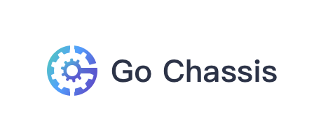

[](https://travis-ci.org/go-chassis/go-chassis)  [](https://coveralls.io/github/go-chassis/go-chassis) [](https://goreportcard.com/report/github.com/go-chassis/go-chassis) [](https://godoc.org/github.com/go-chassis/go-chassis) [](http://hits.dwyl.io/go-chassis/go-chassis)  [](https://join.slack.com/t/go-chassis/shared_invite/enQtMzk0MzAyMjEzNzEyLTRjOWE3NzNmN2IzOGZhMzZkZDFjODM1MDc5ZWI0YjcxYjM1ODNkY2RkNmIxZDdlOWI3NmQ0MTg3NzBkNGExZGU)      

Go-Chassis is a microservice framework for rapid development of microservices in Go

### Why use Go chassis

go chassis is designed as a protocol-independent framework, any protocol 
is able to integrate with go chassis and leverage same function like load balancing,
circuit breaker,rate limiting, routing management, those function resilient your service

go chassis makes service observable by bringing open tracing and prometheus to it.

go chassis is flexible, many different modules can be replaced by other implementation, 
like registry, metrics, handler chain, config server etc 

With many build-in function like route management, circuit breaker, load balancing, monitoring etc,
your don't need to investigate, implement and integrate many solutions yourself.

go chassis supports Istio platform, Although Istio is a great platform with a service mesh in data plane, 
it surely decrease the throughput and increase the latency of your service 
go chassis can bring better performance to go program, 
you can use Istio configurations to control go chassis.

# Features
 - **Pluggable registrator and discovery service**: Support Service center, istio pilot, kubernetes and file based registry, 
 fit both client side discovery and server side discovery pattern 
 - **Pluggable Protocol**: You can custom your own protocol, by default support http and grpc
 - **Multiple server management**: you can separate API by protocols and ports
 - **Circuit breaker**: Protect your micro service system in runtime
 - **Route management**: Able to route to different service based on weight and match rule to achieve Canary Release easily
 - **Client side Load balancing**: Able to custom strategy
 - **Rate limiting**: Both client side and server side rate limiting
 - **Pluggable Cipher**: Able to custom your own cipher for AKSK and TLS certs
 - **Handler Chain**: Able to add your own code during service calling for client and server side
 - **Metrics**: Able to expose Prometheus metric API automatically and custom metrics reporter
 - **Tracing**:Use opentracing-go as standard library, easy to integrate tracing impl
 - **Logger**: You can custom your own writer to sink log, by default support file and stdout
 - **Hot-reconfiguraion**: Powered by go-archaius, configurations can be reload in runtime, like load balancing, circuit breaker, rate limiting
 - **Dynamic Configuration framework**: Powered by go-archaius, developer is able to develop a service which has hot-reconfiguration feature easily
 - **Fault Injection**: In consumer side, you can inject faults to bring chaos testing into your system
 
You can check [plugins](https://github.com/go-chassis/go-chassis-plugins) to see more features

# Get started 
1.Generate go mod
```bash
go mod init
```
2.Add go chassis 
```shell script
GO111MODULE=on go get github.com/go-chassis/go-chassis
```
if you are facing network issue 
```bash
export GOPROXY=https://goproxy.io
```

3.[Write your first http micro service](http://docs.go-chassis.com/getstarted/writing-rest.html)


# Documentations
You can see more documentations in [here](http://docs.go-chassis.com/), 
this online doc is for latest version of go chassis, if you want to see your version's doc,
follow [here](docs/README.md) to generate it in local

# Examples
You can check examples [here](examples)

NOTICE: Now examples is migrating to [here](https://github.com/go-chassis/go-chassis-examples)
# Communication Protocols
Go-Chassis supports 3 types of communication protocol.
1. Rest - REST is an approach that leverages the HTTP protocol for communication.
2. Highway - This is a RPC communication protocol, it was deprecated.
3. grpc - native grpc protocol, go chassis bring circuit breaker, route management etc to grpc.
## Debug suggestion for dlv:
Add `-tags debug` into go build arguments before debugging, if your go version is go1.10 onward.

example:

```shell
go build -tags debug -o server -gcflags "all=-N -l" server.go
```

Chassis customized `debug` tag to resolve dlv debug issue:

https://github.com/golang/go/issues/23733

https://github.com/derekparker/delve/issues/865

# Eco system
this part introduce some eco systems that go chassis can run with
## Apache ServiceComb
With ServiceComb service center as registry, go chassis supply more features like contract management 
and [multiple service registry](https://github.com/apache/servicecomb-service-center/blob/master/docs/aggregate.md), 
highly recommended. that will not prevent you from using kubernetes or Istio, 
Because service center can aggregate heterogeneous registry 
and give you a unified service registry entry point.

## Kubenetes and Istio
go chassis has k8s registry and Istio registry plugins, and support Istio traffic management
you can use spring cloud or Envoy with go chassis under same service discovery service.

# Other project using go-chassis
- [apache/servicecomb-kie](https://github.com/apache/servicecomb-kie): 
A distributed configuration management service
- [apache/servicecomb-mesher](https://github.com/apache/servicecomb-mesher): 
A service mesh able to co-work with go chassis


# To start developing go chassis

1. Install [go 1.12+](https://golang.org/doc/install) 

2. Clone the project

```sh
git clone git@github.com:go-chassis/go-chassis.git
```

3. Download vendors
```shell
cd go-chassis
export GO111MODULE=on 
go mod download
#optional
export GO111MODULE=on 
go mod vendor
```
NOTICE：if you do not use mod, We can not ensure you the compatibility. 
however you can still maintain your own vendor, 
which means you have to solve compiling issue your own.


4. Install [service-center](http://servicecomb.apache.org/release/)


